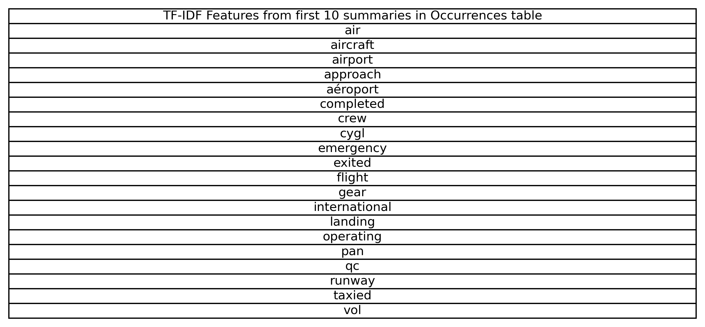
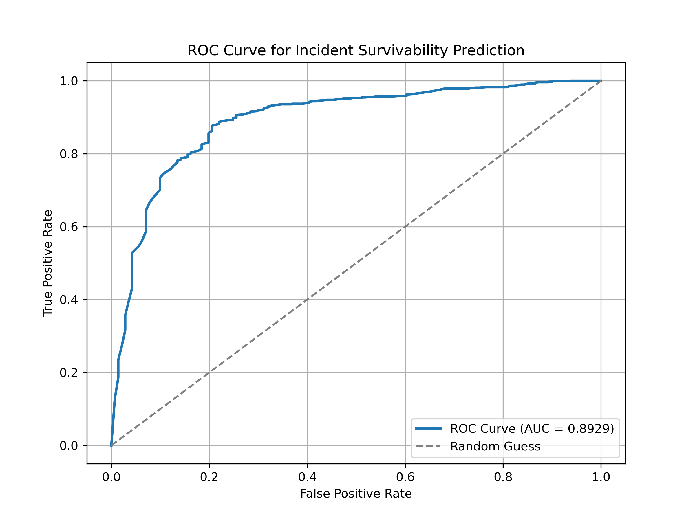
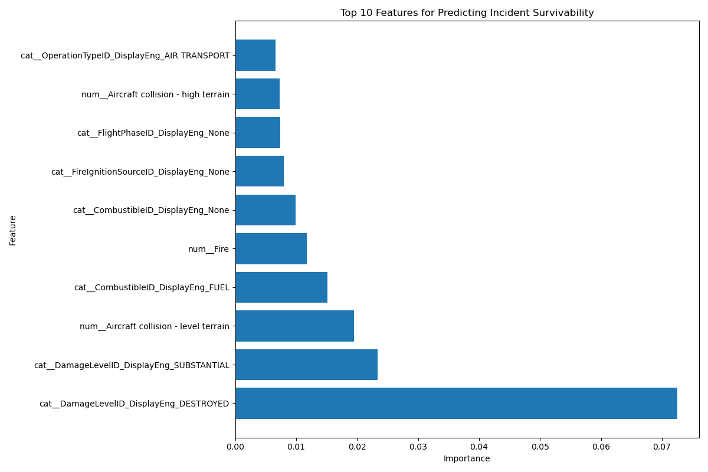
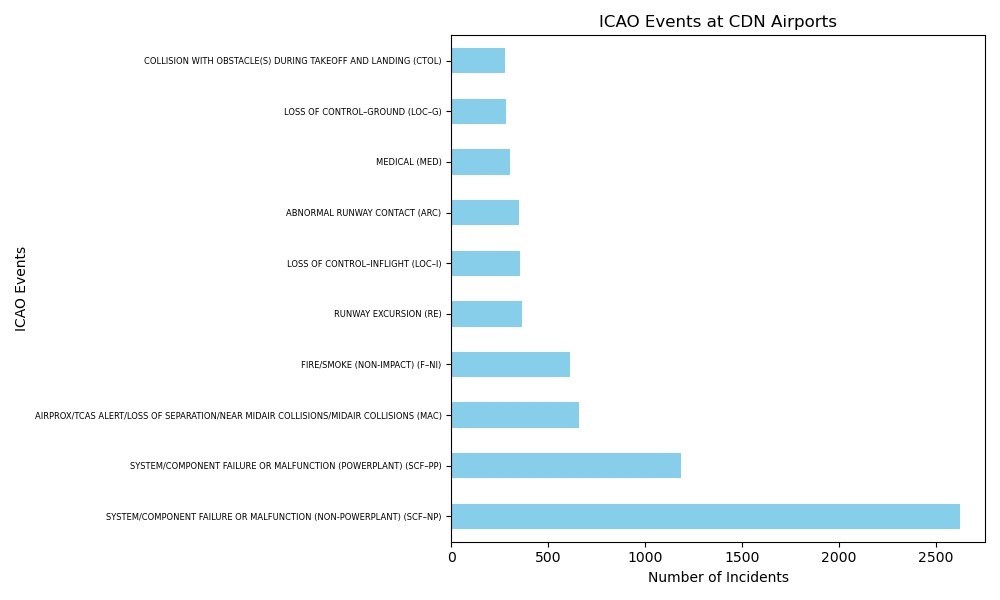
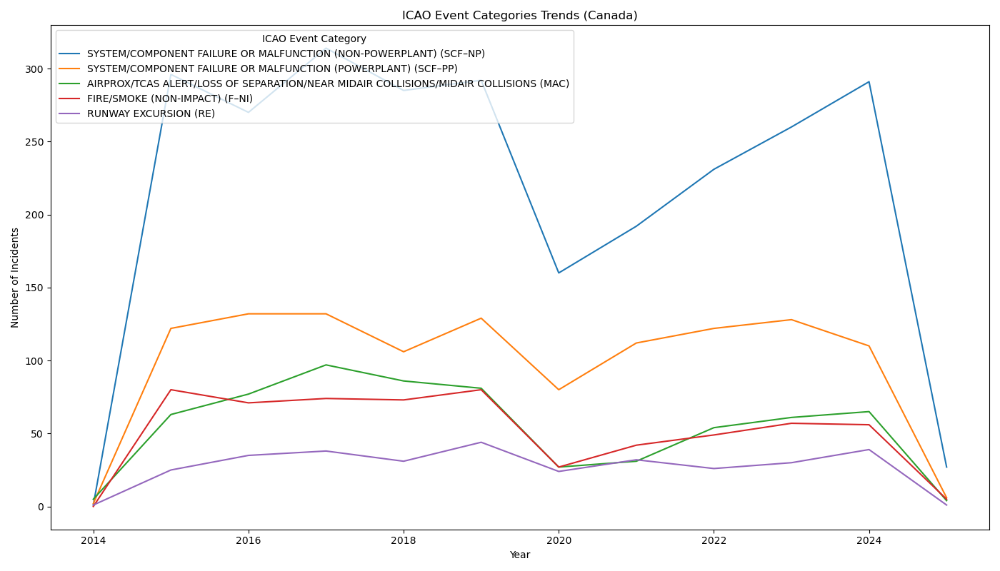

# DATA SCIENCE Take Home Assignment: Data Analysis with Python

## Question 3: Data Completeness
- **Question:**
Describe in detail how you would leverage the Summary field in the Occurrence data to predict future
occurrences. You may consider use of additional libraries in your approach. What would the main
challenges be, and what technical approaches would you take to overcome these? Demonstrate your
approach with relevant data examples.
- **Answer:**  
  Leverage NLP Approaches to derive features from the summary field. These can either be used in a model that works with classification like randomforest or xgboost, or it could be used in deep learning potentially, to predict factors that may be likely before an incident such as weather, location, aircraft, pilot status etc. that the summaries may hold.

  Below you can see a quick example, I used TFIDF to get some feature words out of the first 10 summaries in occurrences (which uses frequency of words to guess at their importance, a simple and limited model but useful for showing what I mean). You could then use the weights of these words in a model, or transform them into other features, for future predictons. There are more NLP techniques beyond TFIDF such as NER, to grab the most important words from a text. You would likely want to grab all the most important or common words from your entire training set, then add them as features to each OccID (either with their weights or just one hot encoding) and train an ML model

  Some issues with the data are that some of it is in english and some of it is in french. You could use ML models that already exist to detect french, such as fasttext, and then use something like deep_translator to translate the french text. Or you can simply leave the french text as is, since a machine learning model or NN probably won't care (I have not tested this myself), and translating introduces the possibiltiy of false information due to translator errors.

- **Visualization:**  
  

## Question 4: Predicting Survival Probability
- **Question:**
Develop a model that predicts the probability of surviving a safety incident. What are the key factors
associated with survivability? What are the strengths and weaknesses of your analysis and what would
your next steps be with this model?
- **Approach:**  
  Took the approach of modelling with a randomforest, targetting SurvivableEnum as a target. randomforest doesnt require normalized values and works well with categorical data which is why I chose it. I removed all SurivableEnum = 3, which is unknowns, as it seemed they would not be useful in a model, but I do not know precisely what unknown means in this context so valuable data could be lost in doing so. The events from events_and_phases were converted to one hot encoded features for each OccId. As well, to make it one row/one sample per OccId, I took the first entry of each OccId for every table I used - this limits the accuracy since I don't entirely know what I removed. I took only the airport and the ICAO event from events as categorical features. From aircraft, I took only columns which ended in _DisplayEng, since they contain the same cat. data as the numerical values and french, but those would be redundant and I could convert back to the categorical DisplayEng names at the end. I did not use the injury table, as my conception of the model was to find features that help predict or prevent non-survivable incidents.

  The data dictionary provided on the ASIS website is not especially useful for elucidating what each entry/data point actually means.

  That said, as the results show, the #1 predictor of survivable was the aircraft being destroyed or incurring substantial damage. I believe this proves the model did work somewhat. Though it also found _None for combustible and flightphase as being important features, more work would have to be done to investigate whether thats a signal for something real or the model features being poorly selected.

  For future investigation, I would more carefully prune out features, especially those that are not actionable, assuming the intent is to find factors that make incidents more survivable. E.g. being destroyed after the incident is not useful if you want to know how to prevent lethal incidences. I would also add in more features from other tables potentially. I would also consider using a model other than randomforest, such as xgboost or something else entirely.

- **Results:**  
Question 4 Classification Report for Survivability Prediction Model (RandomForest):

| Class | Precision | Recall | F1-score | Support |
|-------|----------|--------|----------|---------|
| NS  | 0.78     | 0.35   | 0.48     | 141     |
| Surv   | 0.89     | 0.98   | 0.93     | 745     |
| **Accuracy** | NA | NA | 0.88 | 886 |
| **Macro Avg** | 0.83 | 0.66 | 0.71 | 886 |
| **Weighted Avg** | 0.87 | 0.88 | 0.86 | 886 |

**ROC AUC Score:** 0.9115

My overpruning of the data led to a smaller dataset than I had initially wanted, further changes to how I engineered the features and cleaned the data could be done so there are more samples. the results show the issue of an imbalanced dataset, because the number of survivable incidents is much greater. I would likely downsample on the survivable cases, I dont think upsampling on the small number of nonsurvivable cases would make truly good predictions (but thats my personal opinion)

- **Visualization:**  
  
  

## Question 5: Canadian Event Trends
What ICAO event categories are most common at Canadian airports? Is there any trend or pattern evident
in these Canadian events?

- **Answer**

## Most Common ICAO Event Categories
The most common ICAO event categories at Canadian airports are:
1. System/Component Failure (Non-Powerplant)
2. System/Component Failure (Powerplant)
3. Near Mid Air Collision
4. Fire/Smoke
5. Runway Excursion
6. Loss of Control-Inflight
7. Abnormal Runway Contact
8. Medical
9. Loss of Control-Ground
10. Collision with Obstacles During Takeoff/Landing

## Trends over time
There is almost no data before 2014, I assume due to an administration change in whether information is made public or not. Since 2014, the most obvious trend is a downward trend in 2020 due to a decreased number of flights overall, decreasing all ICAO incidents for 2020. Fire/Smoke and Near Mid Air Collisions appear to have gone down after 2020 from their pre-pandemic levels as well, slightly.

